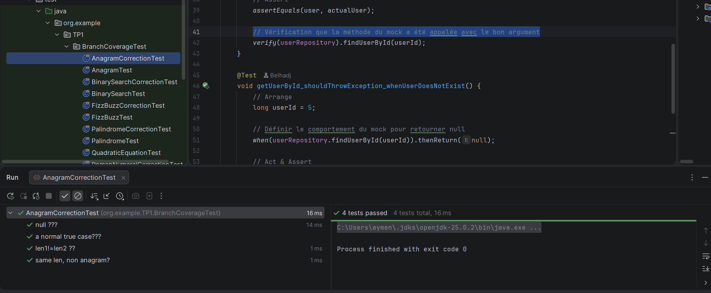
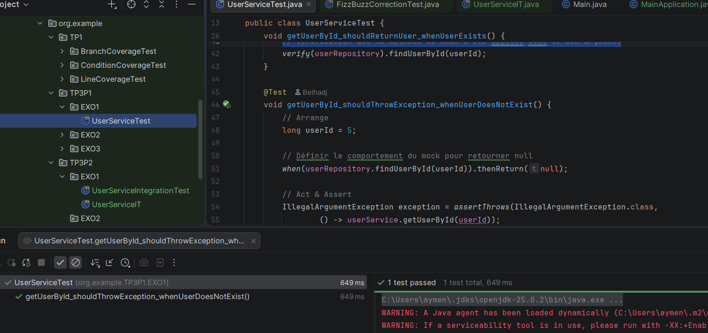
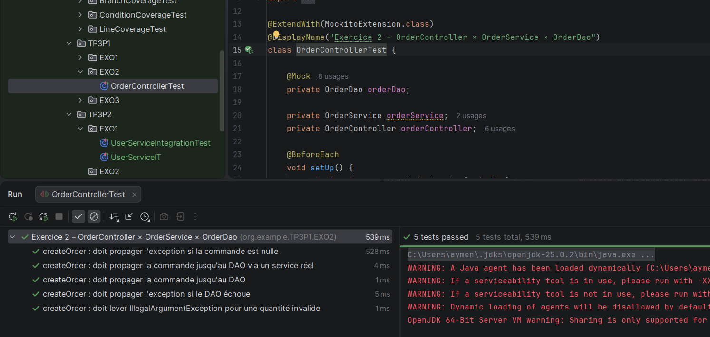
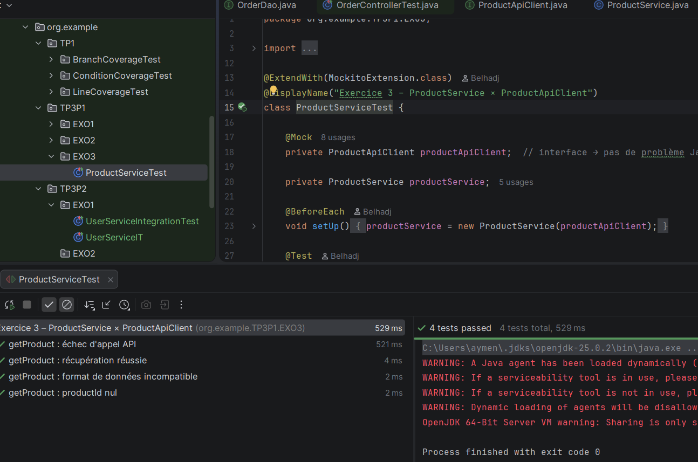

# Tp_AQL – Tests Unitaires & Tests d'Intégration

> **Auteur :** Belhadj  
> **Repository :** [jeSUSiop/Tp_AQL](https://github.com/jeSUSiop/Tp_AQL)  
> **Langage :** Java 25 (OpenJDK)  
> **Framework de test :** JUnit 5 + Mockito

---

## Structure du projet

```
src/
└── test/
    └── java/
        └── org/example/
            ├── TP1/
            │   ├── BranchCoverageTest/
            │   │   ├── AnagramCorrectionTest
            │   │   ├── AnagramTest
            │   │   ├── BinarySearchCorrectionTest
            │   │   ├── BinarySearchTest
            │   │   ├── FizzBuzzCorrectionTest
            │   │   ├── FizzBuzzTest
            │   │   ├── PalindromeCorrectionTest
            │   │   ├── PalindromeTest
            │   │   ├── QuadraticEquationTest
            │   │   └── RomanNumeralCorrectionTest
            │   ├── ConditionCoverageTest/
            │   └── LineCoverageTest/
            ├── TP3P1/
            │   ├── EXO1/
            │   │   └── UserServiceTest
            │   ├── EXO2/
            │   │   └── OrderControllerTest
            │   └── EXO3/
            │       └── ProductServiceTest
            └── TP3P2/
                └── EXO1/
                    ├── UserServiceIntegrationTest
                    └── UserServiceIT
```

---

## TP1 – Couverture du Code

### Objectif

Écrire des tests unitaires selon les critères de couverture **lignes**, **branches** et **conditions** pour les classes suivantes.

---

### Exercice 1 – Palindrome

La méthode `isPalindrome(String s)` vérifie si une chaîne est un palindrome (ignore espaces et casse).

**Bug détecté :** Dans l'implémentation originale, les incréments `i++` et `j--` sont inversés (`j++` et `i--`), provoquant une boucle infinie. Une classe `PalindromeCorrectionTest` a été créée pour corriger ce bug. La correction consiste à remplacer `j++` par `j--` et `i--` par `i++`.

---

### Exercice 2 – Anagram

La méthode `isAnagram(String s1, String s2)` vérifie si deux chaînes sont des anagrammes.

**Bug détecté :** La boucle `for` utilise `i <= s1.length()` au lieu de `i < s1.length()`, provoquant un `StringIndexOutOfBoundsException`. Une classe `AnagramCorrectionTest` corrige ce comportement.

**Résultat des tests – `AnagramCorrectionTest` :** ✅ 4 tests passed (16 ms)

| Test | Statut |
|---|---|
| `null ???` | ✅ |
| `a normal true case???` | ✅ |
| `len1!=len2 ??` | ✅ |
| `same len, non anagram?` | ✅ |



---

### Exercice 3 – BinarySearch

La méthode `binarySearch(int[] array, int element)` recherche un élément dans un tableau trié.

**Bug détecté :** La condition `while (low < high)` devrait être `while (low <= high)` pour inclure le cas où `low == high`. Une classe `BinarySearchCorrectionTest` documente et corrige ce comportement.

---

### Exercice 4 – QuadraticEquation

La méthode `solve(double a, double b, double c)` résout une équation du second degré.

Aucun bug détecté dans cette implémentation.

---

### Exercice 5 – RomanNumeral

La méthode `toRoman(int n)` convertit un entier en chiffre romain.

**Bug détecté :** La boucle `for` utilise `i <= symbols.length` au lieu de `i < symbols.length`, provoquant un `ArrayIndexOutOfBoundsException`. Une classe `RomanNumeralCorrectionTest` corrige ce comportement.

---

### Exercice 6 – FizzBuzz

La méthode `fizzBuzz(int n)` retourne "Fizz", "Buzz", "FizzBuzz" ou le nombre selon les règles classiques.

**Remarque :** La condition `if (n <= 1)` lève une exception pour `n = 1`, alors que 1 est un entier positif valide. Une classe `FizzBuzzCorrectionTest` documente ce comportement.

---

### Remarques sur la couverture

Pour les exercices où deux critères de couverture (ex: lignes et branches) donnent exactement les mêmes cas de test, cela est dû à la structure simple du code (peu de branches imbriquées). C'est notamment le cas pour `FizzBuzz` et `QuadraticEquation`.

---

## TP3 Partie 1 – Tests d'Intégration avec Mocks

### Objectif

Écrire des tests d'intégration en utilisant **Mockito** pour simuler les dépendances entre modules.

---

### Exercice 1 – UserService × UserRepository

**Scénario :** `UserService.getUserById(long id)` récupère un utilisateur via `UserRepository`.

**Tests écrits dans `UserServiceTest` :**
- `getUserById_shouldReturnUser_whenUserExists` : vérifie que `UserRepository.findUserById` est appelé avec le bon argument et retourne l'utilisateur attendu.
- `getUserById_shouldThrowException_whenUserDoesNotExist` : quand `findUserById` retourne `null`, `getUserById` doit lever une `IllegalArgumentException`.

**Résultat :** ✅ 1 test passed (649 ms)



---

### Exercice 2 – OrderController × OrderService × OrderDao

**Scénario :** `OrderController.createOrder(Order order)` délègue à `OrderService`, qui délègue à `OrderDao`.

**Tests écrits dans `OrderControllerTest` :**

| Test | Statut |
|---|---|
| `createOrder : doit propager l'exception si la commande est nulle` | ✅ |
| `createOrder : doit propager la commande jusqu'au DAO via un service réel` | ✅ |
| `createOrder : doit propager la commande jusqu'au DAO` | ✅ |
| `createOrder : doit propager l'exception si le DAO échoue` | ✅ |
| `createOrder : doit lever IllegalArgumentException pour une quantité invalide` | ✅ |

**Résultat :** ✅ 5 tests passed (539 ms)



---

### Exercice 3 – ProductService × ProductApiClient

**Scénario :** `ProductService.getProduct(String productId)` appelle `ProductApiClient.getProduct(productId)` pour récupérer les données d'un produit depuis une API externe.

**Tests écrits dans `ProductServiceTest` :**

| Test | Statut |
|---|---|
| `getProduct : échec d'appel API` | ✅ |
| `getProduct : récupération réussie` | ✅ |
| `getProduct : format de données incompatible` | ✅ |
| `getProduct : productId nul` | ✅ |

**Résultat :** ✅ 4 tests passed (529 ms)



---

## TP3 Partie 2 – Tests d'Intégration avec Testcontainers

### Objectif

Remplacer les mocks par de véritables conteneurs Docker via **Testcontainers**, pour des tests d'intégration plus réalistes et plus fiables.

### Exercice 1 – UserService avec Testcontainers

Les classes `UserServiceIntegrationTest` et `UserServiceIT` reprennent les scénarios de la partie 1 en utilisant des conteneurs Docker réels au lieu de mocks Mockito, garantissant une isolation complète entre les tests.

**Approche :**
- Utilisation de `@Testcontainers` et `@Container` pour démarrer automatiquement les conteneurs.
- Configuration de Spring Boot (`@SpringBootTest`) pour pointer vers le port exposé par le conteneur.
- Les tests vérifient les mêmes scénarios que `UserServiceTest` mais dans un environnement plus proche de la production.

---

## Technologies utilisées

| Technologie | Version | Usage |
|---|---|---|
| Java | OpenJDK 25.0.2 | Langage principal |
| JUnit 5 | 5.x | Framework de test |
| Mockito | 5.x | Mocking des dépendances |
| Testcontainers | latest.stable | Tests d'intégration avec Docker |
| Spring Boot | 3.x | Contexte d'application pour les tests IT |
| Maven | 3.x | Gestion des dépendances |
| IntelliJ IDEA | 2024.x | IDE de développement |

---

## Lancer les tests

```bash
# Lancer tous les tests
mvn test

# Lancer uniquement les tests TP1
mvn test -Dtest="org.example.TP1.**"

# Lancer uniquement les tests TP3P1
mvn test -Dtest="org.example.TP3P1.**"

# Lancer avec couverture (JaCoCo)
mvn test jacoco:report
```

---

## Résumé des résultats

| Classe de test | Exercice | Tests | Résultat |
|---|---|---|---|
| `AnagramCorrectionTest` | TP1 – EXO2 | 4 | ✅ Passed |
| `UserServiceTest` | TP3P1 – EXO1 | 1 | ✅ Passed |
| `OrderControllerTest` | TP3P1 – EXO2 | 5 | ✅ Passed |
| `ProductServiceTest` | TP3P1 – EXO3 | 4 | ✅ Passed |
